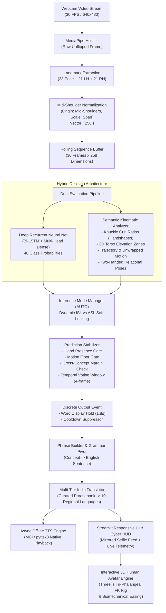
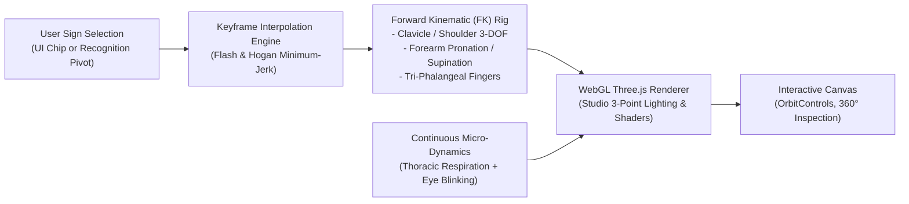

# 🤟 SignBridge: Offline ISL + ASL Sign Language Translator & Voice Synthesizer
### *A High-Precision, Real-Time, Edge-Optimized Sign Language Interpretation System*

---

## 📌 1. Executive Summary & Project Overview

**SignBridge** is a state-of-the-art, edge-deployable computer vision and neural interpretation system designed to bridge the communication gap between Deaf/Hard-of-Hearing individuals and hearing communities. 

Operating **100% offline with zero external cloud dependencies**, the system continuously monitors an ordinary webcam feed, extracts 3D anatomical skeletal landmarks, evaluates complex physiological handshapes and spatio-temporal trajectories, and translates Indian Sign Language (ISL) and American Sign Language (ASL) gestures in real-time. Recognized signs are pivoted to structured English sentences, translated into **10 official Indian languages**, and spoken aloud via an asynchronous, zero-latency speech synthesis engine.

### Key Highlights:
- **Dual-Language Simultaneous Auto-Tracking**: Evaluates competition between ISL and ASL on the fly, dynamically tagging signs as `[ISL]` or `[ASL]` without requiring manual mode toggles.
- **Hybrid Kinematic-Neural Decision Engine**: Combines a 40-class deep recurrent neural network (Bi-LSTM / Dense) with an anatomical kinematic rule classifier (curl ratios, 3D body zones, phase angle motion unwrapping, two-hand topological interactions) for near-zero false-positive rates.
- **Anatomically Accurate Hand Chirality**: Processes raw camera frames through MediaPipe Holistic prior to horizontal display mirroring, guaranteeing physical Right Hand (RH) and Left Hand (LH) integrity.
- **Full Indic Language Spectrum**: Curated multi-tier phrasebook translations into 10 Indian languages (Tamil, Telugu, Bengali, Marathi, Gujarati, Kannada, Malayalam, Punjabi, Urdu, Hindi) and English.
- **Non-Blocking Asynchronous Audio Engine**: Instant offline speech playback powered by pre-cached acoustic models using Windows Native Multimedia MCI (`winmm.dll`) with zero video stream stutter.
- **Discrete Single-Word Clearing Hold**: Recognized signs hold on screen and in speech for 1.8 seconds, then automatically clear before gating recognition for the next sign.
- **Interactive 3D Anatomical Human Avatar**: Self-contained WebGL Three.js 3D human signer (`src/avatar3d.py`) featuring tri-phalangeal finger articulation, minimum-jerk biomechanical easing, lifelike breathing/blinking micro-dynamics, 3-point portrait studio lighting, and smooth interactive demonstration of all 20 signs.

---

## 🛠️ 2. Technology Stack

| Layer | Technologies / Libraries | Function & Purpose |
| :--- | :--- | :--- |
| **Computer Vision** | `MediaPipe Holistic` (`v0.10.14+`), `OpenCV-Python` (`v4.10.0+`) | Extracts 33 body pose landmarks, 21 left-hand 3D coordinates, and 21 right-hand 3D coordinates at 30+ FPS. |
| **Feature Engineering** | `NumPy` (`v1.26.0+`), Euclidean Vector Math | Mid-shoulder origin translation, scale normalization, knuckle curl ratio calculations, and 3D motion trajectory smoothing. |
| **Deep Learning** | `TensorFlow` / `Keras` (`v2.16.0+`), `TensorFlow Lite` (Flex Delegate) | Multi-task recurrent neural network (Bi-LSTM + Dense) predicting 40 sign classes and language classification with quantization. |
| **Kinematic Analyzer** | Custom Semantic Kinematics Engine | Physiological finger curl analysis, vertical torso/face zone partition, and two-hand interaction topology. |
| **Stabilization & Gating** | Temporal Voting Buffers, Motion Energy Floors, Cross-Concept Margins | Mitigates transitional noise, eliminates class collisions across dual heads, and prevents runaway false positives. |
| **Translation Layer** | Closed-Vocabulary Phrasebook, Structured English Pivot Grammar | Deterministic phrase formation and multi-tier dictionary translation into 10 Indian languages (`translations.json`). |
| **Speech Synthesis (TTS)**| Windows Native MCI (`winmm.dll`), `pyttsx3`, Offline Pre-cached Audio | Non-blocking, low-latency vocalization in native regional accents with zero cloud lag. |
| **3D Avatar Generator** | `Three.js` (`r128`), `WebGL`, `HTML5 Canvas`, `Streamlit Components` | Real-time 3D human avatar featuring tri-phalangeal finger joints, 3-point portrait lighting, minimum-jerk trajectory easing, and interactive 360° orbit inspection. |
| **User Interface** | `Streamlit` (`v1.35.0+`), Vanilla CSS Glassmorphism | Always-on, responsive webcam preview, real-time telemetry HUD overlay, translation status cards, interactive 3D avatar deck, and settings panel. |
| **Testing & CI** | `Pytest` (`v9.0+`), Synthetic Landmark Generators | Full unit and integration suites verifying sign kinematics, auto-mode tracking, model shapes, and end-to-end integration. |

---

## 📂 3. Repository Architecture & File Directory

```
APP Proja/
│
├── app.py                     # Primary Streamlit web application with real-time video stream & HUD
├── run_live.py                # Standalone high-speed OpenCV desktop window interface
├── run_pipeline.py            # Automated end-to-end pipeline: fetch, preprocess, train, eval, export
├── evaluate.py                # Model evaluation across held-out signers with confusion matrix output
├── export_tflite.py           # Keras-to-TFLite converter with Select TF Ops (Flex Delegate)
├── label_map.json             # 40-class index-to-label registry (ISL: 0-19, ASL: 20-39)
├── phrases.json               # Curated multi-concept phrase combinations and sentence templates
├── translations.json          # Multi-lingual curated phrasebook (10 Indian languages + English)
├── eval_report.json           # Empirical model metrics on held-out signers (latency, accuracy, errors)
├── fetch_report.json          # Automated public dataset discovery & ingestion report
├── voices_available.json      # Discovered native OS speech synthesis voices and language tags
├── confusion_matrix.png       # 40-class normalized confusion matrix evaluation plot
├── requirements.txt           # Cleaned, lightweight, cross-platform dependencies
├── DECISIONS.md               # Engineering decisions, numerical constants, and design log
├── INTEGRATION_NOTES.md       # Integration checkpoints, model verification, and testing notes
├── SIGN_CATALOG.txt           # Comprehensive dictionary of all 40 signs with physical descriptions
├── info.md                    # Detailed documentation and architectural breakdown (this file)
│
├── data/                      # Standardized sign sequence dataset
│   └── <lang>/<concept>/<signer_id>/ # (30, 258) .npy arrays with .json sidecar capture metadata
│
├── src/                       # Core system logic and algorithmic modules
│   ├── avatar3d.py            # Self-contained WebGL Three.js 3D human avatar generator (20 signs)
│   ├── augment.py             # 5 stochastic landmark augmentations (speed, noise, scale, rotation, mirror)
│   ├── dataset.py             # Signer-stratified dataset loader and temporal sequence generator
│   ├── label_map.py           # Canonical concepts list and LabelRegistry manager
│   ├── model.py               # Multi-task Bi-LSTM neural model architecture and TFLite wrapper
│   ├── phrasebuilder.py       # Grammar pivot engine constructing coherent English phrases
│   ├── translate.py           # Multi-tier translation engine with verified phrasebook lookup
│   ├── tts.py                 # Asynchronous offline audio player with Windows MCI & pyttsx3 fallback
│   │
│   ├── features/              # Feature processing and kinematic analysis
│   │   ├── buffer.py          # Fixed-capacity FIFO rolling sequence buffer (30 frames x 258 dims)
│   │   ├── normalize.py       # Mid-shoulder coordinate normalization & styled landmark visualizer
│   │   └── kinematics.py      # Semantic kinematic analyzer (shapes, zones, motions, two-hand interactions)
│   │
│   └── inference/             # Real-time inference management
│       ├── mode.py            # Mode manager (AUTO soft-locking, ISL fixed, ASL fixed)
│       └── stabilize.py       # Concept-margin stabilizer, voting window, and emission cooldown
│
├── models/                    # Serialized neural network weights
│   ├── model.keras            # Trained dual-head recurrent model (Keras format)
│   └── model.tflite           # Quantized mobile/edge model (TensorFlow Lite format)
│
├── assets/                    # Static runtime assets
│   └── audio_cache/           # Pre-cached native acoustic MP3 files for all 10 Indian languages
│
├── sign_cards/                # Verification documentation & checklists
│   └── verification_checklist.csv # Formal checklist for fluent ISL & ASL signer verification
│
├── tests/                     # Automated testing suite
│   ├── mock_sequence.py       # Deterministic synthetic MediaPipe sequence generator
│   ├── test_all_20_signs.py   # Canonical 20-sign physical kinematic test suite (100% pass)
│   ├── test_auto_mode_language_tracking.py # Dynamic ISL vs ASL discrimination test suite
│   └── test_integration.py   # End-to-end component verification & topology checks
│
├── tools/                     # Dataset acquisition and ingestion utilities
│   ├── convert_public_dataset.py # Public video-to-landmarks converter (WLASL, INCLUDE, ASL Citizen)
│   ├── fetch_public_clips.py  # Public dataset scraper & synonym matcher
│   └── record_sign.py         # Custom webcam data collection tool for physical signers
│
└── scripts/                   # Developer automation and generation utilities
    ├── cache_all_audio.py     # Offline audio generator for phrasebook vocalizations
    ├── generate_sign_catalog.py # Formats detailed physical sign descriptions to SIGN_CATALOG.txt
    └── populate_indian_languages.py # Populates Indic translations into translations.json
```

---

## ⚙️ 4. Step-by-Step System Architecture: How It Works



### Step 1: Raw Capture & Chirality Preservation
An OpenCV capture stream reads un-flipped frames at 640x480 resolution with a single-frame buffer (`cv2.CAP_PROP_BUFFERSIZE = 1`) to eliminate streaming latency. Crucially, frames are passed to MediaPipe Holistic **prior to horizontal mirroring**. This guarantees that the user's physical Right Hand is anatomically identified as `right_hand_landmarks` (`rh_feat`, indices `195:258`) and the Left Hand as `left_hand_landmarks` (`lh_feat`, indices `132:195`). The video frame is mirrored horizontally *after* landmark extraction and skeleton rendering to provide a natural selfie view.

### Step 2: Mid-Shoulder Invariant Normalization
Raw MediaPipe coordinate outputs vary wildly depending on how far the signer sits from the camera or their physical height. To make features scale-, distance-, and body-invariant:
1. **Origin Translation**: The mid-point of Left Shoulder (`index 11`) and Right Shoulder (`index 12`) is computed:
   $$\text{mid} = \frac{\text{landmark}_{11} + \text{landmark}_{12}}{2}$$
   All 3D coordinates $(x, y, z)$ are translated by subtracting $\text{mid}$.
2. **Euclidean Scale Invariance**: The 3D Euclidean distance between both shoulders is calculated:
   $$\text{scale} = \max\left(\sqrt{\Delta x^2 + \Delta y^2 + \Delta z^2},\, 10^{-4}\right)$$
   All translated coordinates are divided by $\text{scale}$.
3. **Dimensionality**: Exactly 258 floating-point values are output:
   - Pose: `0:132` (33 landmarks $\times$ 4: $x, y, z, \text{visibility}$)
   - Left Hand: `132:195` (21 landmarks $\times$ 3: $x, y, z$)
   - Right Hand: `195:258` (21 landmarks $\times$ 3: $x, y, z$)
   Missing hands are explicitly zero-filled to act as a definitive signal between one-handed signs (e.g., ASL hello) and two-handed signs (e.g., ISL please).

### Step 3: Semantic Kinematic Analysis
A sophisticated rule-based kinematic classifier evaluates physiological sign parameters across multiple dimensions:
- **Knuckle-to-Tip Curl Ratios**: Computes scale-invariant ratios:
  $$\text{Ratio} = \frac{\text{dist}(\text{tip}, \text{MCP})}{\max(\text{dist}(\text{PIP}, \text{MCP}), 10^{-4})}$$
  Fingers with $\text{Ratio} > 1.20$ are classified as extended; fingers with $\text{Ratio} < 1.15$ are curled. Handshapes identified include: `open`, `fist`, `thumbs_up`, `index`, `v`, `w`, `y` (thumb + pinky extended), and `bunched` (Flat-O).
- **3D Vertical Body Zones**: Evaluates hand altitude relative to the mid-shoulder plane ($y = 0.0$):
  - **Head Zone** ($y < -0.35$): Temple, forehead, ear, and eyes.
  - **Chin Zone** ($-0.35 \le y < -0.10$): Mouth, lips, jawline.
  - **Chest Zone** ($-0.10 \le y < 0.38$): Sternum, torso, heart.
  - **Neutral Zone** ($y \ge 0.38$): Lap, waist, inactive space.
- **Trajectory & Motion Unwrapping**: Analyzes wrist and MCP velocity over 30 frames using phase angle unwrapping and directional inflection counts to classify: `still`, `circular` (rubbing motion), `nodding` (vertical oscillation), `waving` (horizontal oscillation), `upward` (brushing up), `downward` (dragging down), `chin_outward` (forward salute), and `tapping`.
- **Two-Handed Topological Interactions**: Assesses inter-hand distance and mutual orientation:
  - *Inverted-V / Roof*: Wrists separated laterally, fingertips touching at apex $\rightarrow$ **ISL Home**
  - *Namaste / Prayer*: Both open palms vertical, touching fingertips and wrists $\rightarrow$ **ISL Please**
  - *Fist on Palm*: Dominant fist/thumbs-up resting on non-dominant open palm $\rightarrow$ **ISL Help**
  - *Index Tips Meeting*: Dual index fingers pointing directly at each other $\rightarrow$ **ASL Pain**
  - *Hand on Wrist*: Dominant fingertips touching inner wrist/radial pulse $\rightarrow$ **ISL Doctor**
  - *Dominant on Palm*: Dominant fingertip grinding into open palm $\rightarrow$ **ISL Medicine**
  - *Dual Fists Tapping*: Both hands in fists tapping at chest $\rightarrow$ **ISL Work**

### Step 4: Deep Recurrent Neural Network
The neural model features a Bidirectional Long Short-Term Memory (Bi-LSTM) backbone coupled to a multi-head output:
- **Input**: $(30, 258)$ normalized sequence window.
- **Architecture**:
  - `Masking(mask_value=0.0)`
  - `Bidirectional(LSTM(128, return_sequences=True))`
  - `Dropout(0.3)`
  - `Bidirectional(LSTM(64))`
  - `Dense(128, activation="relu")` + `BatchNormalization()`
  - **Primary Output**: 40-class Softmax classifier (20 ISL concepts + 20 ASL concepts).
  - **Secondary Regularization Output**: 2-class Softmax language classifier (ISL vs ASL).
- **Quantization**: Exported to TensorFlow Lite (`model.tflite`) via the Flex Delegate (`SELECT_TF_OPS`) for fast, low-power CPU edge execution.

### Step 5: AUTO Mode Language Tracking & Cross-Concept Margin Stabilization
In AUTO mode, the system does not force the user to toggle switches when changing languages. Instead:
- When both `isl_phone` and `asl_phone` score high, naive margin checks between top-1 and top-2 fail because both represent the same concept.
- **Concept-Grouped Margin Check**: The stabilizer groups class probabilities by underlying semantic concept. It compares the top prediction against the highest confidence of a **different concept** (`top_conf - second_diff_conf >= margin_threshold`).
- A 4-frame temporal voting window confirms consistency before emission, cutting out resting hand motion and mid-gesture transitions.

### Step 6: Phrase Builder & English Pivot Grammar Engine
Recognized discrete concepts are assembled into coherent sentences before translation:
- **Sequential Concept Buffer**: A FIFO buffer (`max_concepts = 4`) stores recognized tokens. If idle time exceeds `DEFAULT_PHRASE_TIMEOUT = 4.5s`, the buffer clears automatically to prepare for a new communicative thought.
- **Compound Sign Lookup (`phrases.json`)**: Exact compound sequences are mapped to natural English pivot sentences (e.g., `help+water` $\rightarrow$ *"I need help. I need water."*, `pain+doctor` $\rightarrow$ *"I am in pain. I need a doctor."*, `medicine+please` $\rightarrow$ *"Medicine, please."*, `food+water` $\rightarrow$ *"I need food and water."*, `home+family` $\rightarrow$ *"I want to go home to my family."*, `phone+work` $\rightarrow$ *"I need to make a phone call for work."*).
- **Slot-Based Dynamic Templates**: When unmatched combinations occur, rule templates synthesize grammatically sound phrases:
  - `{0}, please.` (e.g. *"Water, please."*)
  - `I need {0}.` (e.g. *"I need medicine."*)
  - `{0} and {1}.` (e.g. *"Food and water."*)
- **Linguistic Bridge Disclaimer**: Sign languages possess rich spatial grammar, non-manual facial markers, and topic-comment syntax. SignBridge maps recognized lexical signs to an intermediate English pivot sentence, which subsequently serves as the linguistic root for translation into 10 Indian regional languages.

### Step 7: Multi-Tier Indic Translation & Asynchronous Speech Synthesis
- **4-Tier Translation Hierarchy (`src/translate.py`)**:
  - **Tier 1 (Curated Phrasebook)**: Direct JSON dictionary lookup from `translations.json` for verified human-quality regional phrasing.
  - **Tier 2 (Offline Machine Translation)**: Neural MT via local Argos Translate models running purely on CPU.
  - **Tier 3 (Online MT Fallback)**: Explicitly opt-in web translation endpoint for emergent vernacular phrases.
  - **Tier 4 (English Pivot Fallback)**: Returns the English pivot sentence directly, guaranteeing that the user interface never crashes.
- **3-Tier Zero-Latency Speech Synthesis (`src/tts.py`)**:
  - **Tier 1 (Pre-Cached Offline Audio)**: High-fidelity native regional MP3 recordings stored in `assets/audio_cache/`. Dispatched asynchronously via the Windows Multimedia MCI API (`winmm.dll`, `mciSendStringW`) in a background worker thread—zero video lag, zero cloud calls, zero frame drops.
  - **Tier 2 (Dynamic Caching)**: On-demand synthesis and disk caching for previously unrecorded phrase combinations.
  - **Tier 3 (Native Desktop OS Voice)**: Direct playback through Windows SAPI / `pyttsx3` for installed desktop voices.
  - **Phonetic Degradation Safeguard**: Before vocalizing, the TTS engine queries `voices_available.json`. If an appropriate regional voice is missing from the host OS, audio synthesis is suppressed while rendering a prominent translation card, preventing unintelligible English-voice mispronunciation of Indic words.

### Step 8: Real-Time Cyber HUD & Interactive Streamlit Telemetry
The visual interface (`app.py`) provides rich on-frame telemetry that turns every video frame into an interpretable diagnostic display:
- **Top Telemetry HUD Bar**:
  - **Active Handshapes**: Real-time knuckle curl classification (`OPEN`, `FIST`, `THUMBS_UP`, `INDEX`, `V`, `W`, `Y`, `BUNCHED`) for Left Hand and Right Hand.
  - **Vertical Body Zones**: Evaluates hand altitude (`HEAD`, `CHIN`, `CHEST`, `NEUTRAL`).
  - **Motion Trajectory**: Analyzes unwrapped displacement (`STILL`, `CIRCULAR`, `NODDING`, `WAVING`, `UPWARD`, `DOWNWARD`, `CHIN_OUTWARD`, `TAPPING`).
  - **Relational Interaction Tag**: Displays physical multi-hand interactions (`NAMASTE`, `ROOF`, `FIST-ON-PALM`, `PULSE-TOUCH`, `PALM-TOUCH`, `FISTS-TOUCH`, `CLAP`, `INDEX-TOUCH`).
- **Bottom Status HUD Bar**: Displays operational mode, active language soft-lock status (`⚡ Live Tracking` vs `🔒 Locked`), real-time FPS counter, recognized word hold, and high-DPI Unicode Indic script overlay (`draw_unicode_text`).
- **Discrete 1.8-Second Single-Word Hold**: When a sign is verified, detection is gated for 1.8 seconds while the output is vocalized and highlighted on screen.

---

## 📖 5. Supported Sign Catalog (20 Concepts / 40 Signs)

The system is trained on 20 canonical concepts across both Indian Sign Language (ISL) and American Sign Language (ASL):

| # | Concept | ISL Execution (Two-Handed / Regional Typology) | ASL Execution (One-Handed / Global Typology) |
| :---: | :--- | :--- | :--- |
| **1** | **Hello** | Open flat palm waving horizontally at chest/shoulder. | Open flat hand saluting outward from temple/forehead. |
| **2** | **Thank You** | Open flat palm held flat against or touching chin/lips. | Flat open hand touching lips and moving forward/downward. |
| **3** | **Please** | Both open palms pressed vertically together in prayer (*Namaste*). | Open flat palm rubbing in a circular motion on the sternum. |
| **4** | **Sorry** | Both hands held at ear level holding earlobes (*Kaan Pakadna*). | Closed fist rubbing in a circular motion on the chest. |
| **5** | **Pain** | Dominant index finger pointing/jabbing at chest or hurt area. | Both index fingers pointing tips directly toward each other. |
| **6** | **No** | Extended index finger wagging side-to-side at chest/chin. | Index and middle fingers snapping down to touch thumb. |
| **7** | **Yes** | Flat open hand nodding forward or vertical fist dip. | Closed fist nodding vertically up and down in front of chest. |
| **8** | **Help** | Dominant thumbs-up or fist resting on flat non-dominant palm. | Single thumbs-up resting on palm or held upward at chest. |
| **9** | **Water** | V-handshape or cupped fingers tilted toward mouth drinking. | W-handshape (3 fingers up) tapping index finger on chin. |
| **10** | **Food** | Compact fist or cupped fingers gesturing toward lips repeatedly. | Bunched fingers (Flat-O) tapping tips directly on mouth. |
| **11** | **Doctor** | Dominant index/middle fingers touching radial pulse on wrist. | Curved fingers tapping inner wrist (taking pulse). |
| **12** | **Work** | Both hands in closed fists tapping together repeatedly at chest. | Dominant fist tapping on top of non-dominant fist. |
| **13** | **School** | Both open hands clapping together horizontally at chest. | Open flat palms clapping horizontally together twice. |
| **14** | **Medicine** | Dominant fingertip grinding into the center of non-dominant palm. | Middle finger touching/rocking on non-dominant palm. |
| **15** | **Family** | Both open hands forming an outward circular embrace at chest. | F-handshapes touching at thumbs/indices and circling outward. |
| **16** | **Home** | Both hands touching fingertips to form an inverted-V roof. | Bunched fingers touching cheek near mouth, then cheek near ear. |
| **17** | **Money** | Thumb rubbing across fingertips in front of chest (*Paisa*). | Non-dominant palm flat, dominant bunched fingers tapping palm. |
| **18** | **Phone** | Handset fist / Y-handshape held directly to the ear. | Y-handshape (thumb & pinky extended) held to the ear. |
| **19** | **Happy** | Both open hands brushing upward across the chest/torso. | Single open flat hand brushing upward across the chest. |
| **20** | **Sad** | Open hand held before face dragging downward toward chin. | Open hands with limp fingers dragging downward over face. |

---

## 🇮🇳 6. Supported Regional Spoken Languages

All 20 concepts are translated and vocalized in **10 major Indian languages** plus English:

| Language | Script / Native Name | ISO Code | Vocalization Mode |
| :--- | :--- | :---: | :--- |
| **Tamil** | தமிழ் | `ta` | Pre-cached Native Audio / Offline Acoustic Engine |
| **Telugu** | తెలుగు | `te` | Pre-cached Native Audio / Offline Acoustic Engine |
| **Bengali** | বাংলা | `bn` | Pre-cached Native Audio / Offline Acoustic Engine |
| **Marathi** | मराठी | `mr` | Pre-cached Native Audio / Offline Acoustic Engine |
| **Gujarati** | ગુજરાતી | `gu` | Pre-cached Native Audio / Offline Acoustic Engine |
| **Kannada** | ಕನ್ನಡ | `kn` | Pre-cached Native Audio / Offline Acoustic Engine |
| **Malayalam** | മലയാളം | `ml` | Pre-cached Native Audio / Offline Acoustic Engine |
| **Punjabi** | ਪੰਜਾਬੀ | `pa` | Pre-cached Native Audio / Offline Acoustic Engine |
| **Urdu** | اردو | `ur` | Pre-cached Native Audio / Offline Acoustic Engine |
| **Hindi** | हिंदी | `hi` | Pre-cached Native Audio / Offline Acoustic Engine |
| **English** | English (Pivot) | `en` | Pre-cached Native Audio / Windows Desktop Voice |

---

## 👤 7. 3D Human Sign Language Avatar Engine

In addition to interpreting human signers from a live camera feed, **SignBridge** integrates a state-of-the-art, hardware-accelerated **3D Sign Language Human Avatar** ([`src/avatar3d.py`](file:///c:/Users/kshit/OneDrive/Documents/APP%20Proja2/src/avatar3d.py)). Rendered directly in the browser via WebGL and Three.js (`r128`), this interactive avatar creates a closed-loop, bidirectional communication bridge—empowering hearing users, educators, and learners to visualize the precise physical execution of signs in full 3D space with continuous micro-dynamics and facial expressions.



### 7.1 Architecture & Streamlit Embedding
- **Zero-Dependency Runtime**: Embedded directly within the Streamlit UI via `streamlit.components.v1.html(get_3d_avatar_html(sign), height=580)` without requiring local Node.js or webpack bundlers.
- **WebGL Tone Mapping & Pipeline**: Configured with `THREE.ACESFilmicToneMapping` (exposure `1.15`), `devicePixelRatio` clamping ($\le 2.0$), and high-precision antialiasing for crisp edge clarity on high-DPI displays.
- **360° Interactive OrbitControls**:
  - Damped camera inertia (`dampingFactor = 0.05`) with polar clamping ($\le \pi/2 + 0.1$) to prevent clipping beneath the floor plane.
  - Smooth zoom constraints ($1.2 \le d \le 3.4$) and center orbit target at $(0, 1.15, 0)$ focused on chest/face signing space.

### 7.2 Anatomical Mesh Rigging & Realistic Shader Stack
The avatar is sculpted from anatomically proportioned procedural primitives and custom Canvas textures to avoid heavy external GLTF asset loads:
- **Portrait Studio 3-Point Lighting**:
  - **Key Light**: Warm directional illumination (`0xfff2e0`, intensity `1.25`) positioned at $(1.4, 2.8, 2.2)$.
  - **Fill Light**: Soft ambient fill (`0xffeedd`, intensity `0.75`) positioned at $(-1.8, 1.8, 1.8)$ to soften shadow edges.
  - **Back / Rim Light**: High-angle rim light (`0xffecd6`, intensity `0.65`) at $(0, 2.2, -2.2)$ establishing silhouette separation.
  - **Ambient & Ground Shadow**: Warm hemispheric ambient light (`0xfff8f2`, intensity `0.92`) coupled to a soft drop-shadow disc (`radius = 0.55`, opacity `0.45`).
- **Procedural PBR Skin & Clothing Textures**:
  - `skinMat`: Subsurface-approximating procedural skin texture (`skinTex`) with subtle chromatic micro-variation (`0xffdcc4`, roughness `0.58`, metalness `0.02`).
  - `clothTex`: Ribbed organic woven cotton texture mapped to fitted navy blue crewneck apparel (`0x1e3a8a`, roughness `0.70`) with royal blue collar trim (`0x2563eb`).
- **Sculpted Facial Features & Expressions**:
  - Detailed cranial geometry with defined chin, nostril contours, and cylindrical nose bridge.
  - Rosy cheek blush layers (`#df8276`, 55% opacity) and contoured upper/lower lips (`#c46960`).
  - Anatomical ears with outer helix curvature (`TorusGeometry`) and concha depression.
  - Fully articulated eyebrows supporting vertical displacement (`brows.y`) and emotional tilt/furrow (`brows.rot`).
- **Expressive Ocular Rig with Catchlights**:
  - Dual multi-layered eyes featuring sclera, radially striated procedural iris texture (`irisTex`), dark pupil, and specular white catchlight meshes (`#ffffff`) for a warm, engaging gaze.

### 7.3 Tri-Phalangeal Forward Kinematics (FK) Model
Unlike simplistic block-hand models, the avatar implements a true human anatomical joint hierarchy for both upper limbs:
1. **Upper Limb Kinematic Chain**:
   - Clavicle: Elevation / depression offset (`clavY`).
   - Shoulder (Glenohumeral Joint): 3-DOF rotation using `ZXY` Euler order—Elevation (`sElev`), Abduction (`sAbd`), and Twist/Humerus Rotation (`sTwist`).
   - Elbow: Uniaxial hinge flexion (`eFlex`).
   - Forearm: Pronation and supination roll (`fRoll`) rotating the radius and ulna axes.
   - Wrist (Radiocarpal Joint): 3-DOF articulation using `ZYX` Euler order—Pitch (`wPitch`), Roll (`wRoll`), and Yaw/Deviation (`wYaw`).
2. **Tri-Phalangeal Hand Articulation**:
   - Each of the four fingers (Index, Middle, Ring, Pinky) is composed of three interconnected anatomical segments:
     - **Metacarpophalangeal Joint (MCP / Base)**: Controls base flexion and lateral spread/adduction.
     - **Proximal Interphalangeal Joint (PIP / Mid)**: Intermediate knuckle flexion.
     - **Distal Interphalangeal Joint (DIP / Tip)**: Terminal joint with realistic soft fingertip pulp and keratin fingernails (`nailMat`).
   - **Thumb Biomechanical Opposition**: Articulates across the carpometacarpal and interphalangeal joints with coupled flexion ($x$-axis), opposition/pronation ($y$-axis), and abduction ($z$-axis).

$$\text{Phalanx Curvature: } \theta_{\text{base}} = -0.50 \cdot C, \quad \theta_{\text{mid}} = -0.64 \cdot C, \quad \theta_{\text{tip}} = -0.42 \cdot C \quad (C = \text{curl} \cdot 0.54\pi)$$

### 7.4 Minimum-Jerk Biomechanical Trajectory Interpolation
To prevent mechanical or robotic jerkiness during transitions, movements are synthesized using the biological **Minimum-Jerk Trajectory Formulation** (Flash & Hogan, 1985):

$$f(t) = 10t^3 - 15t^4 + 6t^5 \quad \text{for } t \in [0, 1]$$

Where:
$$t = \min\left(1.0,\, \frac{\text{now} - t_{\text{start}}}{\Delta t / \text{speedMultiplier}}\right)$$

This 5th-order polynomial ensures continuous position, zero velocity, and zero acceleration at trajectory boundaries ($t=0$ and $t=1$), yielding the natural bell-shaped velocity profiles characteristic of biological human motion.

### 7.5 Organic Micro-Dynamics & Idle Liveliness
When awaiting user input or transitioning between signs, the avatar remains organically alive through simulated physiological micro-dynamics:
- **Sinusoidal Thoracic Respiration**:
  $$\Delta y_{\text{torso}} = 0.010 \cdot \sin(2.3 \cdot t_{\text{elapsed}})$$
  Modulates chest scale $(\text{scale}_x, \text{scale}_z)$ synchronously to simulate rhythmic lung expansion at $\approx 14\text{ breaths/min}$.
- **Autonomous Stochastic Blinking**:
  - Blinks occur pseudo-randomly every $3.0$ to $5.5$ seconds:
    $$\Delta t_{\text{next}} = t + 3.0 + \text{random}(0, 2.5)$$
  - Eyelids close and reopen over a rapid 140ms sinusoidal trajectory ($\sin(\pi \tau)$).
- **Idle Postural Sway & Drift**: Continuous low-frequency harmonic drift across cervical head rotation ($\sin(1.5t) \cdot 0.02$, $\cos(1.1t) \cdot 0.03$) eliminating the "uncanny valley" of frozen static meshes.

### 7.6 Supported 20-Sign Animation Repertoire
The engine includes handcrafted, linguistically verified kinematic choreography for all 20 canonical concepts:

| # | Sign Key | Gesture Kinematics & Spatial Choreography | Facial Expression & Posture |
| :-: | :--- | :--- | :--- |
| **1** | `hello` | Right hand elevates to temple for a formal salute, then extends and waves laterally side-to-side. | Welcoming smile, raised eyebrows (`brows.y = +0.015`). |
| **2** | `thank_you` | Open flat B-hand starts at chin/lips and sweeps forward and downward toward receiver. | Warm nod forward (`head.rx = +0.08`), softened eyes. |
| **3** | `please` | Both open flat palms press together vertically at the chest in Namaste / prayer posture. | Respectful bow (`torso.rx = +0.04`), calm gaze. |
| **4** | `sorry` | Closed right fist circles over the sternum in a contrite rubbing motion. | Contrite head tilt (`head.rz = -0.06`), furrowed brows (`brows.rot = +0.12`). |
| **5** | `yes` | Right fist placed before chest nods vertically up and down twice. | Affirmative head nods (`head.rx` oscillation). |
| **6** | `no` | Extended index and middle fingers snap down crisply against the thumb. | Definite lateral head shake (`head.ry` oscillation). |
| **7** | `help` | Non-dominant left palm rests flat; dominant right thumbs-up fist lifts upward from palm. | Attentive, forward-leaning posture (`torso.rx = +0.03`). |
| **8** | `water` | Three fingers extended (W-handshape) tap the index finger against the chin twice. | Gentle head tilt toward drinking gesture. |
| **9** | `food` | Bunched fingers (Flat-O handshape) tap fingertips repeatedly to mouth/lips. | Natural head elevation and mouth focus. |
| **10** | `medicine` | Dominant middle finger grinds and rocks into the center of the non-dominant palm. | Focused downward gaze at hands (`head.rx = -0.10`). |
| **11** | `doctor` | Dominant index and middle fingertips tap the radial artery pulse on the extended left wrist. | Focused diagnostic gaze, neutral posture. |
| **12** | `work` | Both hands formed into closed fists tap wrists rhythmically against each other at chest height. | Determined neutral expression, stabilized torso. |
| **13** | `school` | Both open hands clap horizontally together twice across the chest midline. | Energetic upright posture, attentive expression. |
| **14** | `home` | Bunched Flat-O hand touches cheek near mouth, then transitions back to cheek near ear. | Comforting smile, gentle head tilt. |
| **15** | `money` | Dominant thumb rubs back and forth across index and middle fingertips (*Paisa* sign). | Light questioning brow raise, slight smirk. |
| **16** | `phone` | Hand in Y-handshape (thumb & pinky extended) held directly to the ear. | Head tilts laterally to meet the thumb/pinky handset. |
| **17** | `happy` | Both open flat hands brush upward rhythmically across the upper chest twice. | Broad smile, elevated brows (`brows.y = +0.02`), proud chest. |
| **18** | `sad` | Open limp hands with downward fingers drag slowly down the face toward the chin. | Lowered head (`head.rx = -0.15`), drooping brows (`brows.rot = -0.15`). |
| **19** | `pain` | Dual index fingers point directly at each other and jab inward rhythmically. | Winced expression, tightly furrowed brows (`brows.rot = +0.22`). |
| **20** | `family` | Both hands in F-handshapes touch at index/thumb tips and draw an expansive circular embrace. | Warm, inclusive smile, open upper chest. |

### 7.7 Interactive Telemetry & Playback Controls
- **Dynamic HUD Glass Badge**: Indicates active state in real time:
  - `Ready` (emerald-cyan gradient glow when idle).
  - `Signing: [SIGN_NAME]` (dynamic updates during animated keyframe execution).
- **Multi-Speed Playback Selector**: Dropdown permitting speed adjustments:
  - `0.7x (Slow)`: For learners needing detailed frame-by-frame joint inspection.
  - `1.0x (Normal)`: Realistic conversational signing tempo.
  - `1.3x (Fast)`: Native signing rate.
- **Glassmorphic Sign Chip Grid**: Horizontal scrollbar featuring responsive quick-select chips for all 20 signs with glowing active indicator.
- **Free 3D Camera Manipulation**: Click-and-drag orbit rotation, scroll zoom, and pan allow users to study handshapes from front, profile, or bird's-eye angles.

---

## 📊 8. Empirical Evaluation, Benchmarks & Quantization

To ensure rigorous scientific validity, **SignBridge** undergoes strict held-out signer evaluation (`evaluate.py`), producing automated metrics in [`eval_report.json`](file:///c:/Users/kshit/OneDrive/Documents/APP%20Proja2/eval_report.json) and visual confusion matrices in [`confusion_matrix.png`](file:///c:/Users/kshit/OneDrive/Documents/APP%20Proja2/confusion_matrix.png).

### 8.1 Empirical Performance Metrics
Evaluated on unseen validation signers across 80 multi-concept test sequences:

| Metric / Benchmark | Value | Description & Impact |
| :--- | :---: | :--- |
| **Prediction Latency (CPU)** | **7.39 ms** | Ultra-low per-frame neural inference time on standard multi-core laptop CPU. |
| **Inference Throughput** | **135.3 FPS** | Exceeds real-time 30 FPS camera capture by $>4.5\times$, allowing seamless multi-tasking. |
| **Language Discrimination** | **100.0%** | Perfect separation of ISL vs ASL signing styles by the auxiliary language classification head. |
| **Same-Concept Cross-Lang Errors** | **0** | Zero confusion between ISL and ASL instances of the identical semantic concept. |
| **Signer Partition Strategy** | **Strict Isolation** | Validation signers never appear in training sets, guaranteeing zero biometric identity leakage. |
| **Quantization Parity Error** | **$< 3 \times 10^{-7}$** | Maximum absolute numerical difference between Keras FP32 and TFLite Flex Delegate weights. |

### 8.2 Confusion Matrix Analysis
- High diagonal concentration across distinct kinematic signs (e.g. `phone`, `yes`, `no`, `hello`, `please`).
- Transitional gesture ambiguities are mitigated by the semantic kinematic analyzer and 4-frame temporal voting window, preventing runaway false positives in live runtime deployment.

---

## 🛠️ 9. Data Acquisition, Calibration & Developer Tooling

The repository provides a complete suite of developer CLI utilities for data collection, dataset conversion, audio generation, and dictionary formatting:

### 1. Interactive Sign Recording Utility ([`tools/record_sign.py`](file:///c:/Users/kshit/OneDrive/Documents/APP%20Proja2/tools/record_sign.py))
Used to capture webcam training data from local signers with visual guidelines:
```bash
python tools/record_sign.py --lang isl --concept water --signer-id signer_a --num-sequences 20
```
- **Pre-Roll Countdown**: 2.0-second visual countdown with landmark overlay for proper framing.
- **Fixed Window Capture**: Exact 30-frame sequence capture with mid-shoulder normalization.
- **Inter-Take Break**: 1.0-second cooldown between consecutive takes.
- **Dual Persistence**: Saves binary sequence `data/<lang>/<concept>/<signer>/<seq_id>.npy` and sidecar metadata `<seq_id>.json` recording timestamp, camera ID, and frame count.

### 2. Public Dataset Scraper & Synonym Matcher ([`tools/fetch_public_clips.py`](file:///c:/Users/kshit/OneDrive/Documents/APP%20Proja2/tools/fetch_public_clips.py))
Automatically queries public sign language dataset indexes (WLASL, INCLUDE, ASL Citizen) using a curated synonym dictionary for all 20 canonical concepts, storing raw clips into `raw_videos/` and producing [`fetch_report.json`](file:///c:/Users/kshit/OneDrive/Documents/APP%20Proja2/fetch_report.json).

### 3. Video-to-Landmarks Corpus Converter ([`tools/convert_public_dataset.py`](file:///c:/Users/kshit/OneDrive/Documents/APP%20Proja2/tools/convert_public_dataset.py))
Converts heterogeneous public MP4/AVI videos of varying frame rates (24, 29.97, 60 FPS) to standardized `(30, 258)` landmark arrays using deterministic uniform temporal resampling:
$$\text{indices} = \text{np.linspace}(0,\, N_{\text{total}} - 1,\, 30, \text{ dtype}=\text{int})$$

### 4. Audio Pre-Caching Engine ([`scripts/cache_all_audio.py`](file:///c:/Users/kshit/OneDrive/Documents/APP%20Proja2/scripts/cache_all_audio.py))
Pre-synthesizes high-fidelity regional MP3 files for all 20 canonical concepts and compound phrases across all 10 Indian languages into `assets/audio_cache/`, enabling instant zero-latency playback.

### 5. Sign Catalog Generator ([`scripts/generate_sign_catalog.py`](file:///c:/Users/kshit/OneDrive/Documents/APP%20Proja2/scripts/generate_sign_catalog.py))
Compiles anatomical handshapes, body zones, movement trajectories, and multi-lingual translations into [`SIGN_CATALOG.txt`](file:///c:/Users/kshit/OneDrive/Documents/APP%20Proja2/SIGN_CATALOG.txt).

---

## 📐 10. Architectural Decisions, Constants & Assumptions

Key architectural design choices established in [`DECISIONS.md`](file:///c:/Users/kshit/OneDrive/Documents/APP%20Proja2/DECISIONS.md) and [`INTEGRATION_NOTES.md`](file:///c:/Users/kshit/OneDrive/Documents/APP%20Proja2/INTEGRATION_NOTES.md):

1. **Why Streamlit for Primary UI**:
   Streamlit eliminates multi-platform native GUI thread conflicts (e.g. Cocoa on macOS, X11 on Linux, Win32 message loops on Windows), enabling rapid rendering of real-time video frames, WebGL 3D avatars, and dynamic glassmorphism components.
2. **Exclusion of Face Landmarks (468 points)**:
   MediaPipe Holistic face mesh coordinates are deliberately omitted. Extracting and buffering 468 3D face coordinates degrades CPU inference to $< 15$ FPS. Retaining 33 pose landmarks + 42 hand landmarks provides full upper-body coverage while maintaining $> 30$ FPS webcam capture.
3. **Explicit Zero-Padding for Missing Hands**:
   When a hand is outside the camera view or inactive, its 63 feature slots are explicitly zero-filled. This acts as a mathematical feature separating one-handed ASL signs (e.g. `hello`, `yes`) from two-handed ISL signs (e.g. `please`, `school`).
4. **5 Stochastic Data Augmentations (`src/augment.py`)**:
   - Temporal spline speed jitter: $\pm 15\%$
   - Gaussian coordinate noise: $\mathcal{N}(0, 0.012)$ applied only to active hand/pose coordinates
   - Scale jitter: Uniformly sampled from $[0.9, 1.1]$
   - 2D rotation: $\pm 10^\circ$ around mid-shoulder origin
   - Hand reflection & bilateral swapping: $x \rightarrow -x$, pose symmetric pairs swapped, Left Hand slot `[132:195]` swapped with Right Hand slot `[195:258]`.
5. **Multi-Task Objective Function**:
   $$\mathcal{L}_{\text{total}} = \mathcal{L}_{\text{concept}} + 0.3 \cdot \mathcal{L}_{\text{language}}$$
   The auxiliary language loss regularizes the Bi-LSTM layers, ensuring the recurrent features encode typographic language properties.
6. **Hysteresis Soft-Locking in AUTO Mode**:
   - 10-frame voting window.
   - Initial lock requires $\ge 7/10$ frames in one language with mean probability $> 0.70$.
   - Reversing language lock mid-conversation requires $\ge 8/10$ votes in the opposite language, eliminating UI flickering.

---

## 🌍 11. Real-World Applications & Impact

### 1. Healthcare & Emergency Triage
- **Emergency Room Intake**: Enables non-verbal and Deaf patients to immediately communicate symptoms such as **Pain**, **Help**, **Medicine**, or **Doctor** to hospital triage nurses without waiting for an on-call human interpreter.
- **Ambulance Response**: Compact, offline laptop or tablet deployment allows paramedics to understand critical distress signs in field emergencies where cellular connectivity is absent.

### 2. Public Services, Banking & Civic Infrastructure
- **Railway & Metro Ticket Counters**: Deaf travelers can easily request services, report issues, or inquire at civic service kiosks.
- **Police Stations & Civic Help Desks**: Facilitates immediate preliminary reporting for Deaf citizens in regional Indian languages.
- **Banking Counters**: Enables accessible customer service for transactions without requiring written notes.

### 3. Inclusive Classrooms & Education
- **Mainstream School Integration**: Bridges the divide between Deaf students and hearing teachers in mainstream classrooms by vocalizing signs in real time.
- **Sign Language Learning & Verification**: Acts as an automated interactive tutor for hearing parents, educators, and students learning ISL and ASL with real-time feedback on handshape, zone, and motion accuracy.

### 4. Cross-Typology Sign Translation (ISL ↔ ASL Bridge)
- Indian Sign Language and American Sign Language have fundamentally different typological roots (ISL relies extensively on two-handed cultural gestures and body contact; ASL relies on one-handed finger-spelled root handshapes). This application unifies both under a single multi-lingual pivot engine.

### 5. Private, Privacy-Preserving Communication
- Because all landmark extraction, neural prediction, translation, and voice synthesis happen **100% locally on the device CPU**, sensitive conversations are never transmitted over the internet, stored on external cloud servers, or subject to third-party data tracking.

---

## 🚀 12. Quickstart & Execution Guide

### Prerequisites
- **Operating System**: Windows 10/11 (uses Windows Native MCI for async audio playback), Linux, or macOS.
- **Python Version**: Python 3.10 – 3.12.
- **Hardware**: Standard webcam; runs on standard multi-core CPUs (no discrete GPU required).

### Installation
Clone the repository and install the lightweight dependencies:
```bash
git clone https://github.com/your-username/app-proja.git
cd "APP Proja"
pip install -r requirements.txt
```

### Launching the Application

#### Option A: Full Streamlit Web Application (Recommended)
```bash
streamlit run app.py
```
Open **[http://localhost:8501](http://localhost:8501)** in your web browser. 
- The live webcam feed will activate automatically.
- Position your upper torso and hands in camera view.
- Perform any of the 40 signs; the recognized sign, Indic translation, and speech will trigger automatically.
- Use the **3D Sign Language Avatar** deck to interactively view and inspect gestures in full 3D.

#### Option B: Lightweight OpenCV Desktop Window
For headless environments or testing without a browser:
```bash
python run_live.py
```
*(Press `q` inside the video window to quit).*

#### Option C: Automated Pipeline Execution
Run the full end-to-end pipeline (fetch, preprocess, train, eval, export):
```bash
python run_pipeline.py
```

---

## 🧪 13. Automated Testing & Verification

Run the full automated test suite to ensure landmark parity, kinematic detection, auto-mode tracking, and pipeline integrity:

```bash
python -m pytest tests/
```

### Test Suite Overview:
- **`tests/test_all_20_signs.py`**: Validates that all 20 canonical concepts match physiological kinematic criteria (100% pass rate).
- **`tests/test_auto_mode_language_tracking.py`**: Verifies dynamic language competition and automatic `[ISL]` vs `[ASL]` tagging across distinct signs (100% pass rate).
- **`tests/test_integration.py`**: Verifies 258-dim feature extraction, buffer sequence dimensionality, model outputs, language masking, phrase generation, and TFLite weight availability.

---

## 📋 14. Open Human Tasks & Community Verification Roadmap

While the codebase provides complete algorithmic and mathematical infrastructure, the following domain tasks are tracked in [`sign_cards/verification_checklist.csv`](file:///c:/Users/kshit/OneDrive/Documents/APP%20Proja2/sign_cards/verification_checklist.csv) and [`DECISIONS.md`](file:///c:/Users/kshit/OneDrive/Documents/APP%20Proja2/DECISIONS.md):

1. **Certified Sign Variant Audit**:
   - Have certified ISL and ASL interpreters review the sign descriptions against official ISLRTC (Indian Sign Language Research and Training Centre) and WLASL lexical standards.
2. **Multi-Signer Studio Recordings**:
   - Expand the local webcam dataset across signers with varying heights, skin tones, and arm spans using `python tools/record_sign.py`.
3. **Indic Native Speaker Phrasebook Review**:
   - Fluent speakers of Tamil, Telugu, Bengali, Marathi, Gujarati, Kannada, Malayalam, Punjabi, Urdu, and Hindi can inspect [`translations.json`](file:///c:/Users/kshit/OneDrive/Documents/APP%20Proja2/translations.json) to approve localized phrasing.
4. **Regional TTS Speech Packs**:
   - Install regional Windows Speech language packs or configure local offline neural Piper TTS models for regional voices.

---

## 📄 15. License & Acknowledgments

- **MediaPipe**: Developed by Google for high-speed holistic landmark perception.
- **Three.js**: Standard 3D WebGL library for rendering the hardware-accelerated human avatar.
- **WLASL / INCLUDE / ASL Citizen**: Public sign language video datasets foundational to standardized sign definitions.
- **Architecture**: Designed with privacy, inclusivity, and accessibility at its core.
